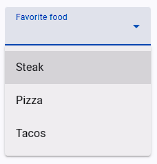

# Material Single Select

This field type is designed for handling `dropdown` elements in web applications, particularly focusing on `search` and `selection` functionalities. The options provided allow for fine-tuning the behavior of the dropdown interaction, ensuring accurate and efficient selection of options.



## Options

| Options                                                                      | Description                                                                                                                                                                                   |
| ---------------------------------------------------------------------------- | --------------------------------------------------------------------------------------------------------------------------------------------------------------------------------------------- |
| [Match options as](#match-options-as)                                        | How the field value should be `matched` with the dropdown options.                                                                                                                            |
| [External Library Name](#external-library-name)                              | If you know that an external library is used in the dropdown then select that library. If the library name is not there then select [Other Material Library](#other-material-library) option. |
| Want until max options in the dropdown element                               | Wait until the maximum number of options are available in the dropdown before proceeding.                                                                                                     |
| Convert the text into lowercase letters and then match the text              | Convert the text to lowercase before matching it with the dropdown options.                                                                                                                   |
| Remove extra space from option text then match the text                      | Remove any extra spaces from the option text before matching.                                                                                                                                 |
| Remove all space from option text then match the text                        | Remove all spaces from the option text before matching.                                                                                                                                       |
| Waiting time after dropdown is open                                          | Sets the waiting time (in milliseconds) after the dropdown is opened before any action is taken.                                                                                              |
| If this field is to select text after the search                             | Indicates whether the field is used to select text after performing a search within the dropdown.                                                                                             |
| Before selecting the dropdown option, check that option is already selected? | Specifies whether the field should check if the option is already selected before attempting to select it again.                                                                              |
| Before selecting the dropdown option, uncheck the already selected options   | Determines whether the field should uncheck any already selected options before selecting the new one.                                                                                        |
| Trigger event on dropdown matched option                                     | Specifies whether an event should be triggered when the matched option is found in the dropdown.                                                                                              |

## Match options as

This option gives the matching options available to select text based on various criteria.

| Options                                | Description                                                                 | Example                                                                                       |
| -------------------------------------- | --------------------------------------------------------------------------- | --------------------------------------------------------------------------------------------- |
| **Equal to Name**                      | Select an option that exactly matches the provided field value.             | Select the option only if it matches the field value `exactly`.                               |
| **Search Name in Any Position**        | Search for the provided field value at any position within the option text. | Select the option if the field value appears `anywhere` in the option text.                   |
| **Match Name from Start-End Position** | Field value to match the option text entirely, from start to end.           | Select the option only if the field value matches the entire option text from `start to end`. |

## External Library Name

Specifies the name of the external library used for handling dropdown interactions. If the library name is not there then select [Other Material Library](#other-material-library) option.

#### Other Material Library

If you select the `Other Material Library` option, you'll need to define the following values, with `Dropdown Options List Query` being **essential**:

| Options                         | Description                                                                                                 |
| ------------------------------- | ----------------------------------------------------------------------------------------------------------- |
| **Dropdown Options List Query** | Specifies the query selector for the elements that represent the selection `options` within the `dropdown`. |
| Dropdown Open Element Query     | Defines the query selector for the element that triggers the opening of the dropdown.                       |
| Dropdown Close Element Query    | Specifies the query selector for the element that triggers the closing of the dropdown.                     |
| Selected Value Element Query    | Specifies the query selector for the element that displays the currently selected value.                    |

## Other Material Libraries

::: details MUI Autocomplete
Dropdown options list selector query is `ul > li.MuiAutocomplete-option` for [MUI Autocomplete](https://mui.com/material-ui/react-autocomplete/).
:::

::: details MUI Select

- How to open [MUI Select](https://mui.com/material-ui/react-select/) dropdown options.
  ```js
  let event = new MouseEvent("mousedown", {
    view: window,
    bubbles: true,
    cancelable: true,
  });
  document.querySelector("input").parentNode.querySelector("div").dispatchEvent(event);
  ```
- Dropdown options list selector query is `ul.MuiMenu-list > li[role="option"]`
  ```js
  // For choice dropdown option
  document.querySelector("div.MuiSelect-select").dispatchEvent(new MouseEvent("mousedown", { bubbles: true }));
  ```
- Close already opened options selector query `div.MuiModal-root[role='presentation'] > div`
  :::

::: details React Select
Dropdown options list selector query is `div[class*='-menu'] div[class*='-option']` for [React Select](https://react-select.com/home).

- Use field [javascript event](/documentation/form-fields/field-settings#trigger-javascript-event) `['mousedown', 'click', 'mouseup']` for open dropdown options and this is selector query `div[class*='-indicatorContainer']`
  :::

::: details Chosen Dropdown
Use field [javascript mouse event](/documentation/form-fields/field-settings#trigger-javascript-mouse-event) `['mouseup']` for [Chosen Dropdown](https://harvesthq.github.io/chosen/).
:::

:::warning NOTE
If you are using a `kendo-ui` dropdown, do not use the field's [javascript event](/documentation/form-fields/field-settings#trigger-javascript-event) option.
:::

## Supported Libraries

- https://mui.com/
- https://mui.com/material-ui/react-select/
- https://react-select.com/home
- https://harvesthq.github.io/chosen/
- https://primeng.org
- https://harvesthq.github.io/chosen/
- https://react-select.com/home
- kendo-ui
- ng-multiselect-dropdown
