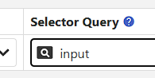

# Segment

Segment is a collection of form fields which is a part of dynamic form, It's structure is exactly like the form but It does not run until you execute it. It has a unique name and the It is executed only by **it's name**

## Predefine Segment

| Segment Name      | Description                                                                                       |
| ----------------- | ------------------------------------------------------------------------------------------------- |
| `{MARK AS SAVED}` | if you click **Mark as Saved** button on the `status bar` then execute `{MARK AS SAVED}` segment. |

## Options

- `Active/Inactive`
- `View Element in Tab`

If element `search` option is not working in segment fields, turn on `View Element in Tab` option and set the `Target Page URL` and `Match Target URL Types`. This allows the segment to correctly identify elements on the target page.

## Execute Segment

- Through [Field Response Action](form-fields/field-response-action).
- Through [Loop](/documentation/field-types/loop)
